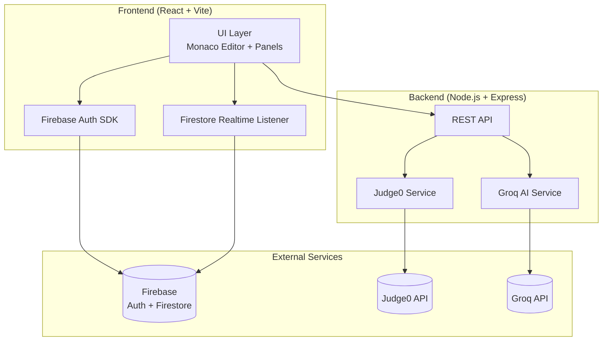

# 🏗️ System Architecture — Debugra (AI Collaborative Code Editor)

## High-Level Architecture



## Data Flow

```
1. USER ACTION          → React UI captures event
2. CODE SYNC            → Firestore realtime write (debounced 300ms)
3. CODE EXECUTION       → POST /api/execute → Judge0 → returns stdout/stderr
4. AI FEATURES          → POST /api/ai/{action} → Groq → returns AI response
5. CHAT                 → Firestore collection write → realtime broadcast
```

> [!IMPORTANT]
> **Key Design Decision:** Firebase handles ALL realtime sync (code state, chat, presence). The Express backend ONLY handles Judge0 execution and Groq AI calls. This keeps the architecture simple and hackathon-friendly.

---

## 🔐 Firebase Schema

```javascript
// Firestore Collections

// 1. users/{userId}
{
  uid: "string",
  displayName: "string",
  email: "string",
  photoURL: "string",
  createdAt: Timestamp
}

// 2. rooms/{roomId}
{
  name: "string",
  createdBy: "userId",
  language: "python",          // current language
  code: "string",              // current code content
  problem: {                   // problem description
    title: "string",
    description: "string",
    examples: ["string"],
    constraints: ["string"]
  },
  activeUsers: ["userId"],     // who's in the room
  createdAt: Timestamp,
  updatedAt: Timestamp
}

// 3. rooms/{roomId}/messages/{messageId}
{
  userId: "string",
  displayName: "string",
  text: "string",
  type: "chat" | "inline",    // inline = line comment
  lineNumber: number | null,
  createdAt: Timestamp
}

// 4. rooms/{roomId}/presence/{userId}
{
  displayName: "string",
  cursor: { lineNumber: number, column: number },
  isTyping: boolean,
  color: "string",             // assigned cursor color
  lastSeen: Timestamp
}
```

---

## 💻 Judge0 Integration

```
Language ID Mapping:
  Python 3  → 71
  JavaScript → 63
  Java       → 62
  C++        → 54

Flow:
  POST /submissions?base64_encoded=true&wait=true
  Body: { source_code, language_id, stdin }
  Response: { stdout, stderr, status, time, memory }
```

> [!TIP]
> Use `wait=true` for synchronous results (simpler). For production, use the polling approach with `?base64_encoded=true&fields=*`.

---

## 🤖 Groq AI Prompts (Optimized for Speed)

### 1. Error Explanation
```
You are a coding mentor. The user wrote code in {language} and got this error:

Code:
{code}

Error:
{error}

Respond in this EXACT JSON format:
{
  "issue": "one-line description of the exact problem",
  "explanation": "simple 2-3 sentence explanation a beginner would understand",
  "fix": "the specific code change needed",
  "bestPractice": "one tip to avoid this in future"
}
```

### 2. Code Fix
```
You are a code repair expert. Fix this {language} code while keeping the user's logic intact.

Code:
{code}

Error (if any):
{error}

Return ONLY the corrected code. No explanations. No markdown fences.
```

### 3. Logic Explanation
```
You are a CS tutor. Explain this code step-by-step:

{selectedCode}

Respond in JSON:
{
  "steps": ["Step 1: ...", "Step 2: ..."],
  "timeComplexity": "O(n)",
  "spaceComplexity": "O(1)",
  "summary": "one-line summary"
}
```

### 4. Test Case Generation
```
Generate test cases for this {language} function:

{code}

Respond in JSON:
{
  "testCases": [
    { "input": "...", "expected": "...", "type": "normal" },
    { "input": "...", "expected": "...", "type": "edge" },
    { "input": "...", "expected": "...", "type": "edge" }
  ]
}
```

### 5. Execution Visualization
```
Trace through this code step by step. Show variable states after each line.

{code}

Input: {input}

Respond in JSON:
{
  "steps": [
    { "line": 1, "code": "x = 0", "variables": {"x": 0}, "explanation": "Initialize x" },
    { "line": 2, "code": "x += 1", "variables": {"x": 1}, "explanation": "Increment x" }
  ]
}
```

> [!NOTE]
> All prompts use `model: "llama-3.3-70b-versatile"` on Groq for best speed/quality tradeoff. Response times: ~200-500ms.

---

## 📁 Folder Structure

```
debugra/
├── client/                    # React frontend (Vite)
│   ├── public/
│   ├── src/
│   │   ├── components/
│   │   │   ├── Editor/
│   │   │   │   ├── CodeEditor.jsx        # Monaco wrapper
│   │   │   │   ├── LanguageSelector.jsx
│   │   │   │   └── ActionBar.jsx         # Run/Fix/Explain buttons
│   │   │   ├── Problem/
│   │   │   │   └── ProblemPanel.jsx
│   │   │   ├── Output/
│   │   │   │   ├── OutputPanel.jsx
│   │   │   │   ├── AIResponsePanel.jsx
│   │   │   │   └── VisualizationPanel.jsx
│   │   │   ├── Chat/
│   │   │   │   └── ChatPanel.jsx
│   │   │   ├── Collaboration/
│   │   │   │   ├── CursorPresence.jsx
│   │   │   │   └── UserAvatars.jsx
│   │   │   ├── Auth/
│   │   │   │   └── AuthModal.jsx
│   │   │   └── Layout/
│   │   │       ├── Header.jsx
│   │   │       └── MainLayout.jsx
│   │   ├── hooks/
│   │   │   ├── useFirebaseAuth.js
│   │   │   ├── useRoom.js
│   │   │   ├── usePresence.js
│   │   │   └── useChat.js
│   │   ├── services/
│   │   │   ├── firebase.js
│   │   │   ├── api.js              # Axios calls to backend
│   │   │   └── judge0.js
│   │   ├── utils/
│   │   │   ├── languageConfig.js
│   │   │   └── problemsData.js     # Hardcoded problems
│   │   ├── App.jsx
│   │   ├── main.jsx
│   │   └── index.css
│   ├── tailwind.config.js
│   ├── vite.config.js
│   └── package.json
│
├── server/                    # Express backend
│   ├── routes/
│   │   ├── execute.js         # Judge0 proxy
│   │   └── ai.js             # Groq AI endpoints
│   ├── services/
│   │   ├── judge0Service.js
│   │   └── groqService.js
│   ├── middleware/
│   │   └── errorHandler.js
│   ├── server.js
│   ├── .env
│   └── package.json
│
├── .gitignore
└── README.md
```

---

## 🚀 Deployment

| Service | Platform | Config |
|---------|----------|--------|
| Frontend | Vercel | `cd client && npm run build` → Deploy `dist/` |
| Backend | Render | Node environment, `cd server && npm start` |
| Firebase | Google Cloud | Auto-managed |

### Environment Variables

**Frontend (.env)**
```
VITE_FIREBASE_API_KEY=
VITE_FIREBASE_AUTH_DOMAIN=
VITE_FIREBASE_PROJECT_ID=
VITE_FIREBASE_MESSAGING_SENDER_ID=
VITE_FIREBASE_APP_ID=
VITE_API_URL=http://localhost:3001  (or Render URL)
```

**Backend (.env)**
```
JUDGE0_API_URL=https://judge0-ce.p.rapidapi.com
JUDGE0_API_KEY=              # RapidAPI key
GROQ_API_KEY=
PORT=3001
CLIENT_URL=http://localhost:5173
```
